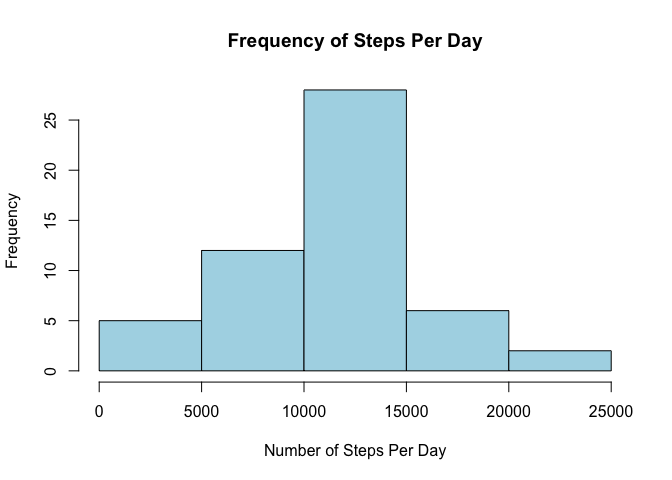
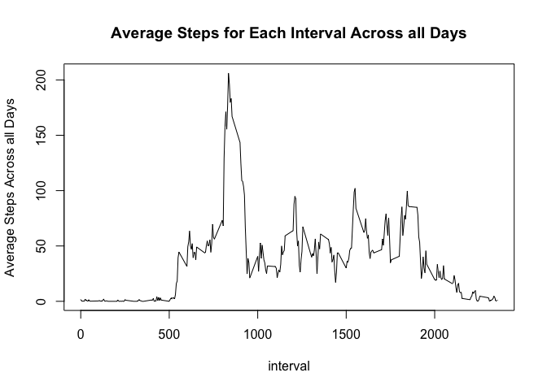
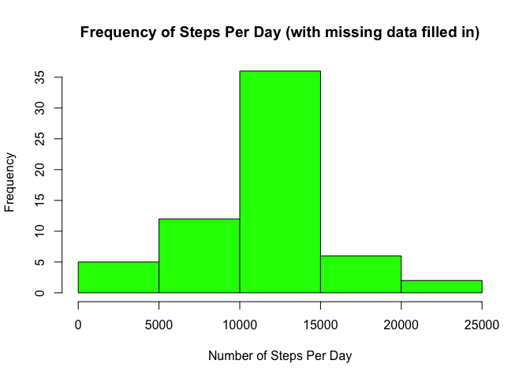
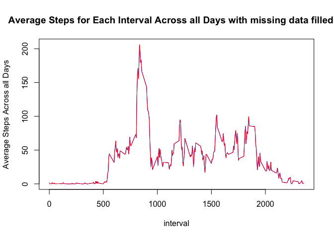
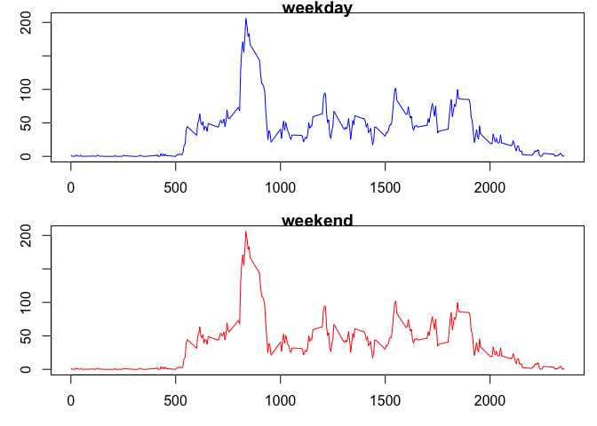

# Peer Assessment 1 - Reproducible Research
Rajiv Sharma  
07/19/15  

Loading and preprocessing the data
-Reading data from a csv file
-Deleting the NAs from the data


```r
activity <- read.csv("/Users/rajivsharma/Desktop/Data Science/Coursera/Reproducible Research/PeerAssessment1/activity.csv", stringsAsFactors = FALSE)
activity$date <- as.Date(activity$date, "%m/%d/%y")
activity1 <- activity[which(!is.na(activity$steps)),]
```
Total number of steps taken per day


```r
library(dplyr)
```

```
## 
## Attaching package: 'dplyr'
## 
## The following object is masked from 'package:stats':
## 
##     filter
## 
## The following objects are masked from 'package:base':
## 
##     intersect, setdiff, setequal, union
```

```r
bydate <- group_by(activity1, date)
stepsbyday <- summarize(bydate, sumsteps=sum(steps))
```

Histogram of total number of steps taken per day


```r
hist(stepsbyday$sumsteps, main="Frequency of Steps Per Day", xlab="Number of Steps Per Day", ylab="Frequency", col="lightblue")
```

 


Mean and Median of the total number of steps taken per day


```r
meansteps <- mean(stepsbyday$sumsteps)
mediansteps <- median(stepsbyday$sumsteps)
meansteps
```

```
## [1] 10766.19
```

```r
mediansteps
```

```
## [1] 10765
```
Average Daily Activity Pattern

Times series plot of the 5-minute interval and the average number of steps taken, averaged across all days


```r
activity2 <- activity1[order(activity1$interval),]
stepsbyinterval <- aggregate(activity2$steps, by=list(activity2$interval), FUN=mean)
colnames(stepsbyinterval) <- c("interval", "AverageSteps")
plot(stepsbyinterval$interval, stepsbyinterval$AverageSteps, type = "l", main = "Average Steps for Each Interval Across all Days", xlab="interval", ylab="Average Steps Across all Days")
```

 
Interval for max number of steps:


```r
maxsteps <- max(stepsbyinterval$AverageSteps)
maxstepsInterval <- stepsbyinterval[stepsbyinterval$AverageSteps == maxsteps,]
```

The 5-minute interval, on average across all days in the dataset, that contains the maximum number of steps is 835

==============================================================================

Imputing missing values

1. Calculate total number of missing values in dataset


```r
Missing <- activity[is.na(activity$steps),]
```

Number of missing values in the dataset are 2304

2. Strategy for filling in all of the missing values - Filling in NAs with mean for that 5-minute interval.


```r
## Adding another column, Average Steps, from the stepsbyinterval dataset to original dataset, activity:
activitym <- merge(activity, stepsbyinterval, by = "interval")
## Replacing NAs with the Average Steps for that interval
activitym$steps[which(is.na(activitym$steps))] <- activitym$AverageSteps[which(is.na(activitym$steps))]
```
3. The new dataset(the original dataset but with the missing data filled in is:


```r
head(activitym)
```

```
##   interval    steps       date AverageSteps
## 1        0 1.716981 2012-10-01     1.716981
## 2        0 0.000000 2012-11-23     1.716981
## 3        0 0.000000 2012-10-28     1.716981
## 4        0 0.000000 2012-11-06     1.716981
## 5        0 0.000000 2012-11-24     1.716981
## 6        0 0.000000 2012-11-15     1.716981
```

4. Histogram of total number of steps taken per day but with the missing data filled in:


```r
## calculate sum of steps per day for orginal data but with missing data filled in
bydatefillin <- group_by(activitym, date)
stepsbydayfillin <- summarize(bydatefillin, sumstepsfillin=sum(steps))
```

```r
hist(stepsbydayfillin$sumstepsfillin, main="Frequency of Steps Per Day (with missing data filled in)", xlab="Number of Steps Per Day", ylab="Frequency", col="green")
```

 


4. Mean and Median of the total number of steps taken per day


```r
meanstepsfillin <- mean(stepsbydayfillin$sumstepsfillin)
medianstepsfillin <- median(stepsbydayfillin$sumstepsfillin)
meanstepsfillin
```

```
## [1] 10766.19
```

```r
medianstepsfillin
```

```
## [1] 10766.19
```

```r
meandiff <- meanstepsfillin - meansteps
mediandiff <- medianstepsfillin - mediansteps
```

The difference in mean is 0 and difference in median is 1.1886792


```r
activity2m <- activitym[order(activitym$interval),]
stepsbyintervalfillin <- aggregate(activity2m$steps, by=list(activity2m$interval), FUN=mean)
colnames(stepsbyintervalfillin) <- c("interval", "AverageSteps")
plot(stepsbyintervalfillin$interval, stepsbyintervalfillin$AverageSteps, type = "l", col="blue", main = "Average Steps for Each Interval Across all Days with missing data filled in", xlab="interval", ylab="Average Steps Across all Days")
lines(stepsbyinterval$interval, stepsbyinterval$AverageSteps, type = "l", col="red")
```

 

Impact of imputing missing data on total daily steps


```r
impactfillin <- merge(stepsbydayfillin, stepsbyday, by="date", all.x=TRUE)
impactfillin$sumsteps[which(is.na(impactfillin$sumsteps))] <- 0
impactfillin$impact <- impactfillin$sumstepsfillin - impactfillin$sumsteps
```

There is no impact on most dates. The only dates with non-zero impact are:


```r
impactrows <- impactfillin[!impactfillin$impact == 0,]
impactrows
```

```
##          date sumstepsfillin sumsteps   impact
## 1  2012-10-01       10766.19        0 10766.19
## 8  2012-10-08       10766.19        0 10766.19
## 32 2012-11-01       10766.19        0 10766.19
## 35 2012-11-04       10766.19        0 10766.19
## 40 2012-11-09       10766.19        0 10766.19
## 41 2012-11-10       10766.19        0 10766.19
## 45 2012-11-14       10766.19        0 10766.19
## 61 2012-11-30       10766.19        0 10766.19
```
Differences in activity patterns between weekdays and weekends

Creating a new factor variable with two levels "weekday" and "weekend":


```r
activitym$days <- weekdays(activitym$date)
weekday = c("Monday", "Tuesday", "Wednesday", "Thursday", "Friday")
weekend = c("Saturday", "Sunday")
activitym$days[which(activitym$days%in%weekday)] <- "weekday"
activitym$days[which(activitym$days%in%weekend)] <- "weekend"
activitym$days <- as.factor(activitym$days)
```

Time-series plot of 5 minute interval and average number of steps taken averaged across weekday or weekend days:


```r
bydays <- group_by(activitym, interval, days)
w <- split(bydays, list(bydays$interval, bydays$days))
ww <- cbind(sapply(w, function(x) colMeans(x[,"AverageSteps"])))
colnames(ww) <- c("AverageSteps")
r <- data.frame(rownames(ww), stringsAsFactors = FALSE)
list <- strsplit(r$rownames.ww., '[.]')
library("plyr")
```

```
## -------------------------------------------------------------------------
## You have loaded plyr after dplyr - this is likely to cause problems.
## If you need functions from both plyr and dplyr, please load plyr first, then dplyr:
## library(plyr); library(dplyr)
## -------------------------------------------------------------------------
## 
## Attaching package: 'plyr'
## 
## The following objects are masked from 'package:dplyr':
## 
##     arrange, count, desc, failwith, id, mutate, rename, summarise,
##     summarize
```

```r
rr <- ldply(list)
rr[,3] <- NULL
colnames(rr) <- c("interval", "days")
rw <- cbind(rr, ww)
rownames(rw) <- NULL
rw$interval <- as.numeric(rw$interval)
rw$days <- as.factor(rw$days)
rwweekday <- subset(rw, rw$days == "weekday")
rwweekend <- subset(rw, rw$days == "weekend")

par(mfrow=c(2,1))
par(mar = c(3, 3, 0.75, 0.75))
plot(rwweekday$interval, rwweekday$AverageSteps, type="l", col = "blue", main = "weekday", xlab = "interval", ylab = "Avg Number of Steps")
plot(rwweekend$interval, rwweekend$AverageSteps, type="l", col = "red", main = "weekend", xlab = "interval", ylab = "Avg Number of Steps")
```

 
